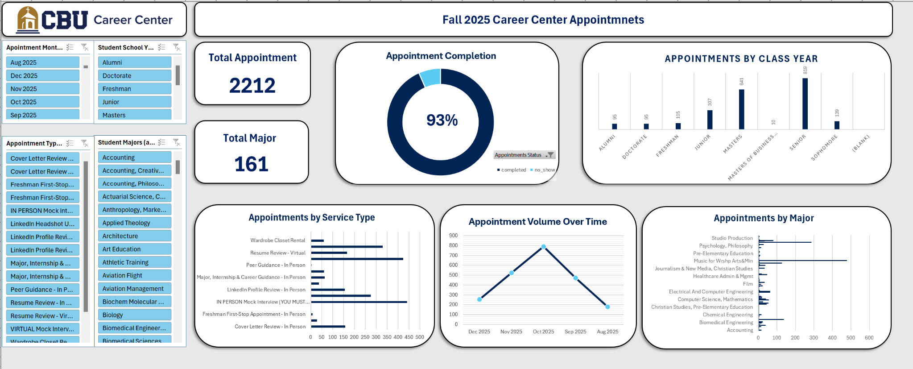

# Career Center Appointment Analytics Dashboard

## Project Overview
This operational dashboard analyzes appointment activity, service utilization, and student engagement trends within the California Baptist University Career Center.

## Business Problem
The Career Center needed a centralized reporting dashboard to monitor appointments, identify service demand, and evaluate appointment completion performance.

## Tools Used
- Microsoft Excel
- Pivot Tables
- Dashboard Visualization
- Data Cleaning

## Key Insights
- Over 2,200 student appointments were completed
- Appointment completion rate reached 93%
- Mock interviews and resume reviews were among the most requested services
- Senior and graduate-level students showed the highest engagement

## Skills Demonstrated
- Operational Analytics
- KPI Reporting
- Service Utilization Analysis
- Dashboard Design
- Trend Analysis

## Business Value
The dashboard helps leadership identify high-demand services and improve student career support strategies.
