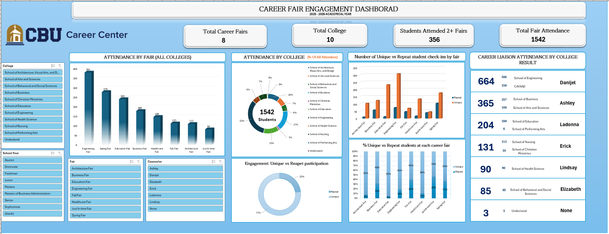

# Career Fair Engagement & Participation Dashboard

## Project Overview
This dashboard evaluates student participation, repeat attendance, and engagement trends across multiple university career fairs.

## Business Problem
The objective was to analyze career fair attendance patterns and measure student engagement across colleges and academic groups.

## Tools Used
- Microsoft Excel
- Pivot Tables
- Dashboard Design
- Data Visualization

## Key Insights
- Engineering and Spring career fairs had the highest attendance
- Repeat participation showed strong engagement across multiple fairs
- Student participation varied significantly by academic college
- Certain colleges demonstrated consistently high attendance rates

## Skills Demonstrated
- Engagement Analytics
- Comparative Reporting
- Attendance Analysis
- KPI Dashboard Development
- Business Intelligence Reporting

## Business Value
The dashboard provides actionable insights for improving career fair planning, outreach strategies, and student engagement initiatives.
