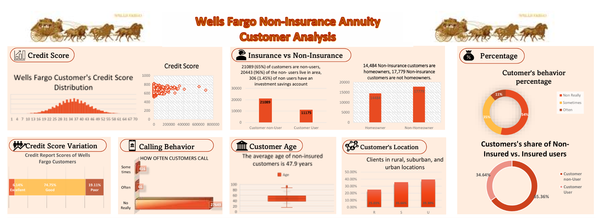

# Wells Fargo Customer Behavior & Non-Insurance Annuity Analysis

## Project Overview
This project analyzes customer behavior, demographic trends, and financial characteristics associated with Wells Fargo non-insurance annuity users.

## Business Problem
The objective was to better understand customer financial behavior and identify trends between insured and non-insured customer groups.

## Tools Used
- Microsoft Excel
- Pivot Tables
- Dashboard Visualization
- Data Analysis

## Key Insights
- Majority of customers were non-insurance users
- Most customers had good credit scores
- Customer calling behavior showed low engagement frequency
- Non-insurance users represented a significant customer segment

## Skills Demonstrated
- Customer Analytics
- Financial Data Analysis
- KPI Reporting
- Dashboard Development
- Data Storytelling

## Business Value
The dashboard provides management-level insights into customer demographics and behavioral patterns that can support financial product strategies.
