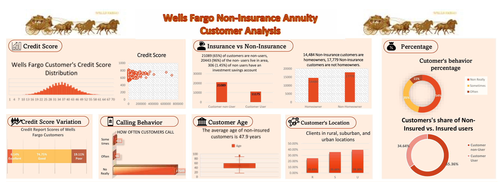
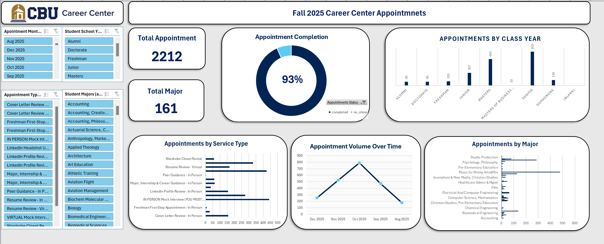
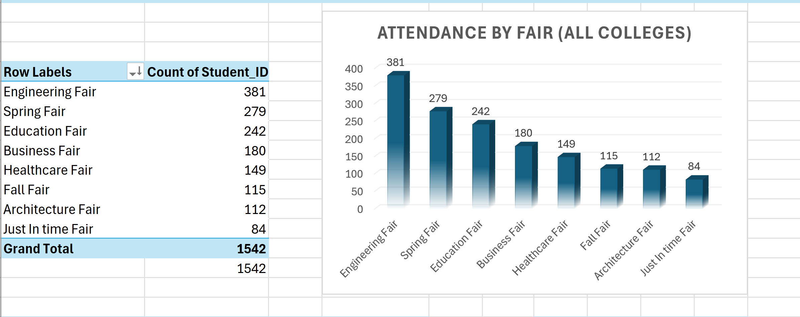
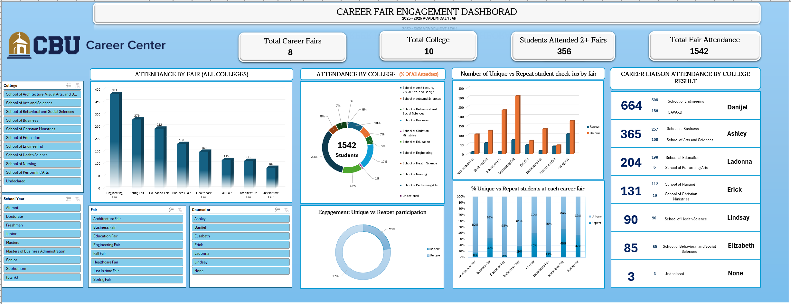

# Data Analytic Projects

**Data Analytics Repo:** Explore a portfolio of data analytics projects that transform raw data into actionable insights. Discover how patterns, trends, and key metrics drive smarter decisions and create measurable business value.

## Excel Projects

### 1. 🏦 Wells Fargo Non-Insurance Annuity Customer Analysis

**Overview:** Analyzed a comprehensive Wells Fargo customer dataset to uncover behavioral patterns, financial profiles, and demographic characteristics associated with non-insurance annuity users — delivering management-level intelligence to support financial product strategy.

**Business Problem:** Distinguish insured vs. non-insured customer segments and identify behavioral, demographic, and financial indicators that define each group.

**Dataset Highlights:**
- 32,264 total customer records with 48 financial and demographic variables
- Variables include: account age, credit score, income, ATM/POS usage, savings balance, mortgage data, home ownership, and geographic location (Rural / Suburban / Urban)

**Key Findings:**

| Insight | Detail |
|---|---|
| **Non-insurance majority** | 21,089 (65.36%) of customers are non-insurance users |
| **Local customer base** | 96% of non-users live in the area; only 1.45% hold investment savings accounts |
| **Credit score profile** | 74.75% rated "Good" · 19.11% "Poor" · 6.14% "Excellent" |
| **Calling behavior** | 27,649 customers (vast majority) rarely call — low engagement |
| **Average customer age** | 47.9 years for non-insured customers (std dev: 14.1 yrs) |
| **Homeownership split** | 14,484 non-insurance customers are homeowners vs. 17,779 non-homeowners |
| **Geographic distribution** | ~40% Urban · ~36% Suburban · ~25% Rural |
| **Behavior frequency** | 54% call "Often" · 35% "Sometimes" · 11% "Not Really" |

**Skills Demonstrated:** Customer Analytics · Financial Data Analysis · Segmentation · KPI Reporting · Dashboard Development · Data Storytelling

📂 [View Project Files](assets/Wellsfargo.xlsx)

---

### 2. 🎓 CBU Career Center — Fall 2025 Appointment Analytics Dashboard

> Supporting pivot table analysis:

**Overview:** Designed and developed an operational Excel dashboard analyzing all student appointment activity, service utilization, and counselor performance across CBU's Career Center during Fall 2025 (August–December 2025).

**Business Problem:** The Career Center lacked a centralized view of appointment trends, service demand, and completion rates. This dashboard gives leadership real-time visibility into operations to improve staffing, resource allocation, and student support strategies.

**Dataset:** 2,212 appointment records · 161 unique student majors · 5 counselors tracked · 5-month period

**Key Findings:**

| Metric | Value |
|---|---|
| **Total Appointments** | 2,212 |
| **Unique Majors Served** | 161 |
| **Appointment Completion Rate** | **93%** |
| **Peak Month** | October 2025 (~800 appointments) |
| **Top Service: In-Person Mock Interview** | 441 appointments |
| **Top Service: Resume Review – In Person** | 424 appointments |
| **Top Service: Virtual Mock Interview** | 330 appointments |
| **LinkedIn Headshot (Iris Booth)** | 275 appointments |
| **Top Class Year** | Seniors (319) · Masters (641) |
| **Top Major Category** | Accounting · Biomedical Engineering · Computer Science |

**Service Breakdown (Full):**

| Service Type | Count |
|---|---|
| IN PERSON Mock Interview | 441 |
| Resume Review – In Person | 424 |
| Virtual Mock Interview | 330 |
| Resume Review – Virtual | 166 |
| LinkedIn Headshot Using Iris Booth | 275 |
| LinkedIn Profile Review – In Person | 156 |
| Cover Letter Review – In Person | 158 |
| Major, Internship & Career Guidance – In Person | 63 |
| Major, Internship & Career Guidance – Virtual | 61 |
| Cover Letter Review – Virtual | 29 |
| LinkedIn Profile Review – Virtual | 37 |
| Wardrobe Closet Rental | 59 |
| Peer Guidance – In Person | 3 |
| Freshman First-Stop (In Person + Virtual) | 10 |

**Skills Demonstrated:** Operational Analytics · KPI Dashboard Design · Service Utilization Analysis · Trend Reporting · Excel Pivot Tables & Power Query

📂 [View Project Files](assets/CBUproject1.xlsx)

---

### 3. 🤝 CBU Career Fair Engagement & Participation Dashboard — 2025–2026

> Supporting pivot table analysis:

**Overview:** Built a multi-dimensional business intelligence dashboard analyzing student attendance, unique vs. repeat participation patterns, college-level engagement, and career liaison performance across all 8 CBU career fairs during the 2025–2026 academic year.

**Business Problem:** Understand which fairs and colleges drive the most student engagement, identify repeat participation trends, and evaluate career liaison effectiveness to improve future career fair planning and outreach.

**Dataset:** 1,542 total check-ins · 8 career fairs · 10 academic colleges · 6 career counselors tracked

**Key Findings:**

| Metric | Value |
|---|---|
| **Total Fair Attendance** | 1,542 check-ins |
| **Total Career Fairs** | 8 |
| **Total Colleges Represented** | 10 |
| **Students Attending 2+ Fairs** | 356 (repeat engagement) |
| **Unique vs. Repeat Split** | 77% Unique · 23% Repeat |

**Attendance by Fair:**

| Fair | Attendance |
|---|---|
| Engineering Fair | **381** |
| Spring Fair | 279 |
| Education Fair | 242 |
| Business Fair | 180 |
| Healthcare Fair | 149 |
| Fall Fair | 115 |
| Architecture Fair | 112 |
| Just In Time Fair | 84 |

**Career Liaison Performance:**

| Counselor | Total Attendance | Top Colleges |
|---|---|---|
| Danijel | 664 | School of Engineering (506) · CAVAAD (158) |
| Ashley | 365 | School of Business (257) · Arts & Sciences (108) |
| Ladonna | 204 | School of Education (198) · Performing Arts (6) |
| Erick | 131 | School of Nursing (112) · Christian Ministries (19) |
| Lindsay | 90 | School of Health Science (90) |
| Elizabeth | 85 | Behavioral & Social Sciences (85) |

**Skills Demonstrated:** Engagement Analytics · Comparative Reporting · Attendance Trend Analysis · KPI Dashboard Development · Business Intelligence · Career Liaison Performance Tracking

📂 [View Project Files](assets/CBUproject2.xlsx)

---

*All dashboards were built in Microsoft Excel using Pivot Tables, Power Query, and custom chart design.*
*Data sourced from California Baptist University Career Center (Handshake) and Wells Fargo customer datasets.*

